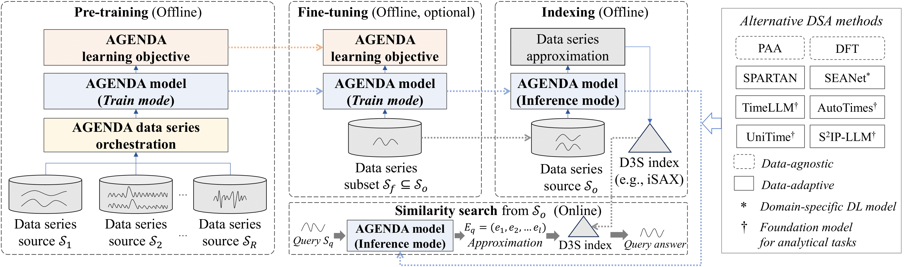

<h1 align="center">AGENDA
</h1>
<h2 align="center"> A General Deep Approximation Framework for Data Series Similarity Search</h2>

AGENDA is a deep learning based framework for time series similarity search. It pretrains a lightweight Transformer on large scale heterogeneous time series corpora to learn transferable representations, and subsequently adapts to new datasets via efficient fine tuning or zero shot inference. This design enables accurate and computationally efficient similarity search across diverse time series domains, while significantly reducing training and deployment costs.

## Framework

We present AGENDA, a novel deep-learning approximation engine that acts as the core neural component of our similarity-search system.



## Installation
To install AGENDA from source, you will need the following tools:
- `git`
- `conda` (anaconda or miniconda)

#### Packages and tools setting

The following key tools and their versions are used in this project:
- **Python**
  - python==3.9.18

- **Machine Learning and Deep Learning**
  - scikit-learn==1.4.1.post1
  - torch==2.5.1

For the complete list of dependencies, please refer to the `environment.yml` and `requirements.txt` files.

#### Steps for installation

**Step 1:** Clone this repository using `git` and change into its root directory.

```bash
git clone https://github.com/paradox0503/AGENDA.git
cd AGENDA/
```

**Step 2:** Create and activate a `conda` environment named `AGENDA`.

```bash
conda env create --file environment.yml
conda activate AGENDA
```
> Note: If you plan to use GPU acceleration, please ensure that you have CUDA installed. You can refer to the [CUDA installation instructions](https://developer.nvidia.com/cuda-downloads) for guidance.

If you do not wish to create the `conda` environment, you can install only the dependencies listed in `requirements.txt` using the following command:
```
pip install -r requirements.txt
```

**Step 3:** :Installation complete!

Start our system using the following command:
```bash
streamlit run Home_page.py
```
In the following section, we describe the datasets and baseline methods considered in our benchmark and evaluation.

### Datasets
AGENDA includes the following datasets:


| Dataset                      |                                                                                                                                    Description                                                                                                                                    |
| :--------------------------- | :-------------------------------------------------------------------------------------------------------------------------------------------------------------------------------------------------------------------------------------------------------------------------------: |
| Astro                      |                                                             is a benchmark astronomical time series dataset consisting of fixed-length (256) stellar light curves                                                    |
| Deep1B                         |                        is a large-scale vector similarity search benchmark released by Facebook, consisting of 1 billion 96-dimensional feature vectors extracted from deep neural networks.It is widely used to evaluate the scalability and efficiency of approximate nearest neighbor search methods.                        |
| FreqSpetra                         |                                                                             is a synthetic time-series dataset consisting of fixed-length sequences (256). Each sequence is generated in the frequency domain by selecting a small number of dominant frequency components and then transformed into the temporal domain via inverse discrete Fourier transform (IDFT).                                                                             |
| RandWalk                        |                                                                                             is a synthetic time-series dataset generated by a random walk process, where each sequence evolves as the cumulative sum of Gaussian noise. All sequences have a fixed length of 256 and are z-normalized before retrieval.                                                                                            |
| SALD                         |                                                     is a real-world neuroscience time-series dataset consisting of fixed-length sequences of 128, which represent neural activity recorded during experimental tasks.                                                     |
| Seismic                          |                         is a real-world time-series dataset from seismology, consisting of fixed-length segments(256) of ground motion recordings.                          |

### Baseline

The following methods were used as baselines.

| Baseline method                      |                                                                                                                                    Description                                                                                                                                    |
| :--------------------------- | :-------------------------------------------------------------------------------------------------------------------------------------------------------------------------------------------------------------------------------------------------------------------------------: |
| PAA                      |                                                             Piecewise Aggregate Approximation, a classic dimensionality reduction technique that reduces the volume of time series data by dividing the sequence into equal segments and calculating the mean value for each segment.                                              |
| SPARTAN                         |                        is a data-adaptive data series approximation method that transforms data series into reduced representation using principle component analysis (PCA). It also includes a dynamic symbolic encoding method that allocates the encoding budget based on the importance of each dimension.                       |
| TimeLLM                         |                                                                             repurposes a frozen LLM for time-series modeling by “reprogramming” the input series into text-prototype/patch representations to align modalities.                                                                             |
| AutoTimes                        |                                                                                             projects time series into a decoder-only LLM’s token-embedding space and uses its autoregressive generation capability to produce future predictions (as the learned representation).                                                                                            |
| DFT                         |                                                     The discrete Fourier transform maps a time series to the frequency domain, where a small set of Fourier coefficients can be used as a compact embedding for similarity search.                                                     |
| SEANet                          |                         is a method that learns Deep Embedding Approximations (DEA) so neural embeddings can replace classical approximations for accurate approximate similarity search over data series.                          |
| UniTime                          |                         is a language-empowered unified model that uses domain instructions with a Language-TS Transformer to generalize time-series representations across domains.                          |
| S²IP-LLM                          |                         aligns time-series embeddings with an LLM’s semantic space by deriving and retrieving “semantic anchors” from word embeddings as prompts.                          |

## Click here for GUI DEMO
[Please view our demonstration video. ]( https://www.youtube.com/watch?v=I-y3wrDl1VQ)

